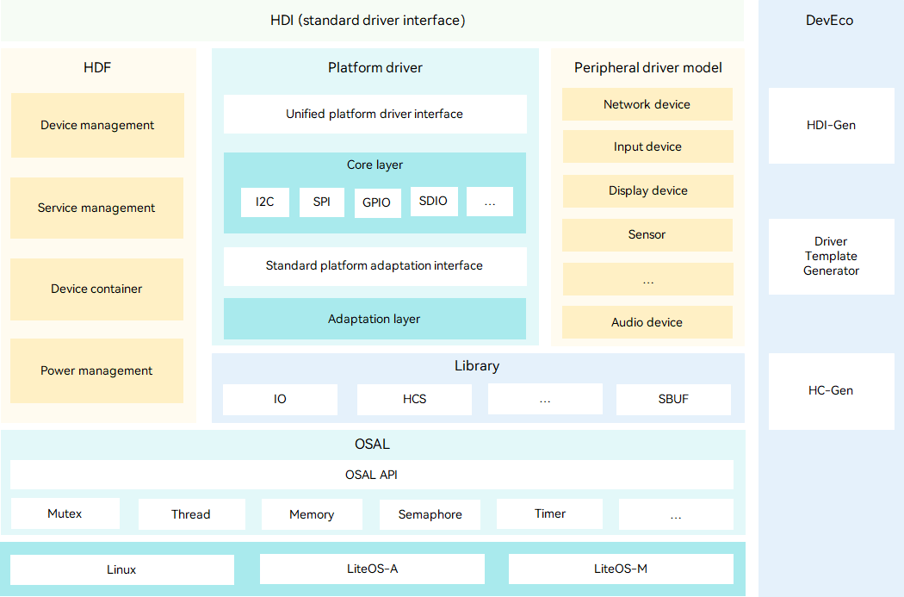

## Contents

- Acquiring OpenHarmony source code
- Introducing project structure and tooling
- Understanding Modularity and target systems
- Target audience: Operating System researchers, enthusiasts and device vendors


## OpenHarmony OS

- Opensource distributed Operating System
- Highly configurable for different scenarios
- Component based design 

Note: Component based design allows flexible combinations of components tailored to the hardware capabilities of the device


## System types

- Mini system (MCUs, e.g. Cortex-M or 32 bit RISC-V)
    - RAM >= 128 KiB
- Small system (application processors, e.g. Cortex-A)
    - RAM >= 1 MiB
- Standard system (application processors)
    - RAM >= 128 MiB

Note: 

- Mini system: Typical products include connection modules, sensors, and wearables for smart home.

- Small system:  This system provides higher security capabilities, standard graphics frameworks, and video encoding and decoding capabilities. Typical products include smart home IP cameras, electronic cat eyes, and routers, and event data recorders (EDRs) for easy travel.

- Standard system: This system provides a complete application framework supporting enhanced interactions, 3D GPU, hardware composer, diverse components, and various animations. Typical products include high-end refrigerator displays.


## Modularity

- Mini, small and standard systems have different requirements
- OpenHarmony offers high flexibility with optimized versions of components
- E.g. Kernel: Linux kernel, [LiteOS-A], [LiteOS-M]

[LiteOS-A]: https://docs.openharmony.cn/pages/v5.0/en/device-dev/kernel/kernel-small-overview.md
[LiteOS-M]: https://docs.openharmony.cn/pages/v5.0/en/device-dev/kernel/kernel-mini-overview.md


## Driver framework

- device drivers are usually highly coupled to the kernel
- OpenHarmony offers multiple kernels
- [HDF] (Hardware Driver Foundation) provides unified driver abstraction

[HDF]: https://docs.openharmony.cn/pages/v5.0/en/device-dev/driver/driver-overview-foundation.md




Note:

The HDF architecture consists of the following:

    - Hardware Device Interface (HDI) layer: provides unified and stable APIs for hardware operations.

    - HDF: provides unified hardware resource management, driver loading management, device node management, device power management, and driver service models. It consists of the device management, service management, Device Host, and PnPManager modules.

    - Unified configuration interface (DevEco Studio): supports abstract description of hardware resources to shield hardware differences, and enables development of universal driver code that is not bound to configuration information. You can use HC-Gen to quickly generate configuration files. This unified configuration interface improves development and porting efficiency.

    - Operating system abstraction layer (OSAL): provides encapsulated kernel operation APIs, including the APIs for the memory, locks, threads, and semaphores, to shield operation differences between different systems.

    - Platform driver layer: provides unified APIs for peripheral drivers to operate board hardware, such as I2C, SPI, and UART buses, and uniformly abstracts the APIs for board hardware operations.

    - Peripheral driver model: provides common driver abstraction models for peripheral drivers to provide standard device drivers and implement driver model abstraction. With standard device driver models, you can deploy drivers through configuration without independent development. The driver model abstraction makes the drivers more general by shielding the interaction between drivers and different system components.


## Obtaining OpenHarmony Source code


## OpenHarmony source code

- OpenHarmony is a highly configurable Operating System Framework
- Organized into Systems, Subsystems and Components
- The [`repo`] tool is used to manage the multi-repository project


## Obtaining the source code

- OpenHarmony is a multi-repository project
- Version-control: [`repo`] and git
- The [manifest] defines which repositories should be checked out

```sh [1-2 | 3 | 4]
repo init -u https://gitee.com/openharmony/manifest \
    -b OpenHarmony-v5.0.3-Release
repo sync -c
repo forall -c 'git lfs pull'
```

[`repo`]: https://gerrit.googlesource.com/git-repo
[manifest]: https://gitee.com/openharmony/manifest


## Targeted Checkouts 

- Modularity means the OH often has multiple alternatives for a component
- `repo init` can be configured to just checkout a subset of the source code
- Check the [manifest readme] for a full list of options

Example: 
```bash
# code for the mini system + related chipsets
repo init -u URL -b BRANCH -g ohos:mini
# mini system + one specific chipset
repo init -u URL -b BRANCH -m chipsets/chipsetN.xml -g ohos:mini
```

[manifest Readme]: https://gitee.com/openharmony/manifest


## Build directories

| Directory | Description |
|-----|------|
| `build` | Build scripts and configuration |
| `out`   | Build output directory |
| `prebuilts` | Prebuilt toolchains |


## Core Source directories

| **Directory**| **Description**|
| -------- | -------- |
| applications | Application samples, for example, **camera**.|
| base | Basic software service subsystem set and hardware service subsystem set.|
| drivers | Driver subsystem.|
| foundation | Basic system capability subsystem set.|
| kernel | Kernel subsystem.|
| test | Test subsystem.|


## Device related

| Directory | Description |
|-----|------|
| `device/board` | |
| `device/qemu`   |  |
| `device/soc` |  |
| `productdefine` | | 
| `vendor` | |